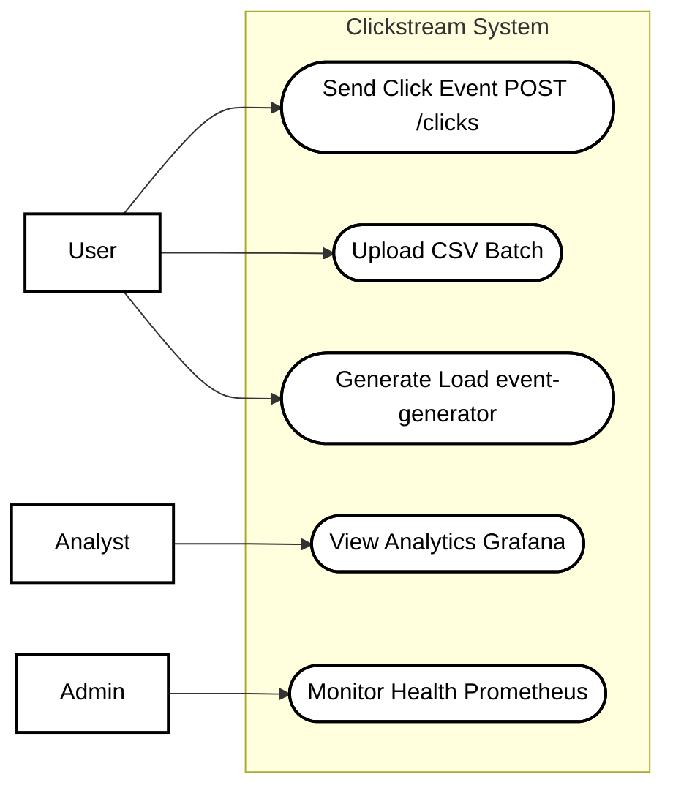
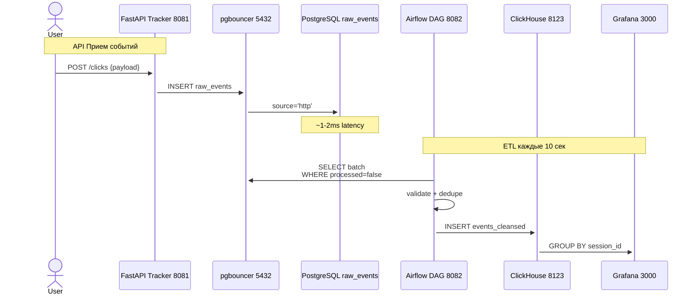
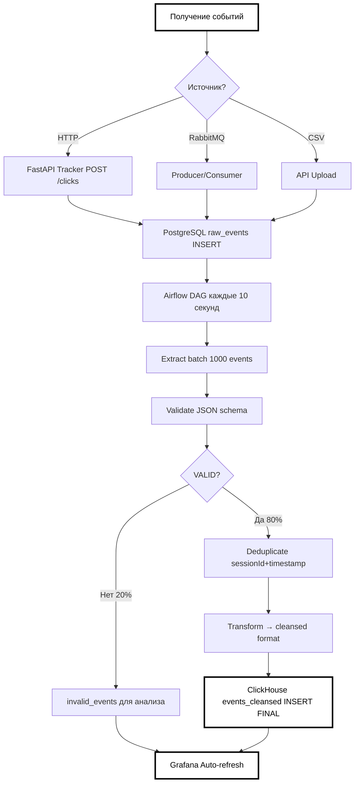
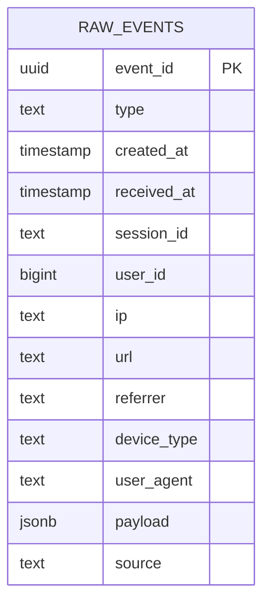
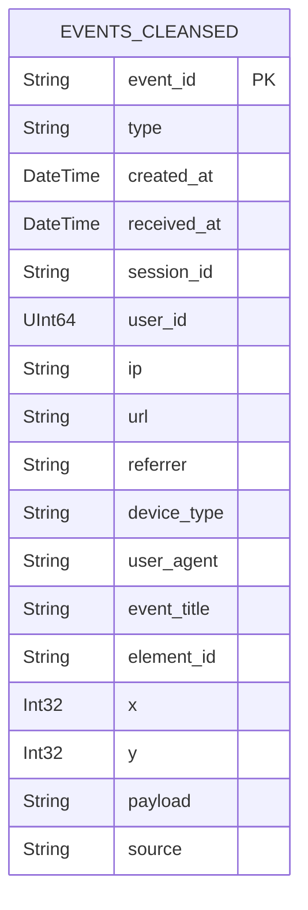

# Clickstream-аналитика

Clickstream-аналитика позволяет детально изучать пути пользователей, выявлять узкие места интерфейсов и оптимизировать конверсионные воронки.

## Описание проекта


Данный проект производит сбор, обработку, изменение и представление событий пользователей на различных веб-сайтах. В качестве событий выступает просмотр страниц или клик по элементам интерфейса (кнопки, ссылки, формы).

Объектом исследования выступает процесс построения аналитической платформы clickstream-данных. Предметом исследования является прототип распределенной системы, реализующий полный цикл обработки событий с использованием современных инструментов больших данных.

### Цель и задачи проекта

**Цель:** Разработка прототипа распределенной clickstream-аналитической платформы для сбора, обработки и визуализации пользовательских событий с высокой производительностью.  


**Задачи:**

1. Создать REST API (FastAPI) для приема событий из разных источников

2. Реализовать конвейер ETL (PostgreSQL → Airflow → ClickHouse)  

3. Настроить мониторинг (Prometheus + Grafana) всех компонентов

4. Обеспечить покрытие тестами >60% (unit + integration)

## Стек технологий


- **FastAPI** — высокопроизводительный веб-фреймворк для API (tracker, основные endpoints)
- **RabbitMQ** — брокер сообщений с поддержкой кластеризации через **HAProxy**
- **PostgreSQL** — оперативное реляционное хранилище с балансировкой через **pgbouncer**
- **Apache Airflow** — оркестратор ETL/ELT процессов
- **ClickHouse** — аналитическая колоночная СУБД для Data Mart
- **Prometheus** — сбор метрик и мониторинг
- **Grafana** — визуализация дашбордов и аналитики


**Python** — основная технология для всех сервисов:
- api (FastAPI)
- tracker (прием кликов)
- event-generator (CSV/HTTP/RabbitMQ)
- producer (RabbitMQ)
- consumer (RabbitMQ)
- unit/integration тесты


**Инфраструктура:**

- Docker Compose — оркестрация контейнеров
- HAProxy — балансировка RabbitMQ кластера
- pgbouncer — пул соединений PostgreSQL

Генератор генерирует по 200 событий в секунду для http и rabbitmq, а также в csv файле папки data лежит файл на 200т. событий.
## Как запустить проект

Весь проект развернут на Docker Compose. Выполните команды из корневой папки проекта:
```bash
docker compose down -v --remove-orphans
docker compose build --no-cache  
docker compose up -d
./cluster-init.sh
```

Последний скрипт инициализирует кластер RabbitMQ с необходимыми настройками.
### Запуск тестов

Для запуска тестов только с включенными системами используйте один из вариантов:

- Вариант 1 (рекомендуемый)
```bash
docker compose --profile tests up tests
```
- Вариант 2
```bash
docker compose up --build tests
```

## Демонстрация

### PostgreSQL (сырые события)

```bash
docker exec -it clickstream-postgres-master psql -U clickstream -d clickstream
select source, count(*) from raw_events group by source;
```

### RabbitMQ UI

```bash
http://localhost:15672/#/queues/%2F/events
```
Логин/пароль:user/password

### tracker 
```bash
http://localhost:15672/#/queues/%2F/events
```
### clickhouse
```bash
docker exec -it clickstream-clickhouse clickhouse-client
DESCRIBE TABLE clickstream.events_cleansed;
select count(*) from clickstream.events_cleansed FINAL;
```
### airflow
```bash
http://localhost:8082/home
```
Логин/пароль:admin/admin
### Prometheus
```bash
http://localhost:9090/targets
```
### Grafana
```bash
http://localhost:3000/dashboards
```
Логин/пароль:admin/admin
# Основная часть

## Анализ предметной области

### Обоснование выбора архитектуры приложения

Система построена по принципу **многослойной архитектуры** (Data Lakehouse pattern) с четким разделением ответственности:

1. **Прием данных** — FastAPI endpoints + RabbitMQ producer/consumer

2. **Оперативное хранение** — PostgreSQL с pgbouncer для буферизации  

3. **ETL/трансформация** — Airflow DAGs для очистки и валидации

4. **Аналитика** — ClickHouse Data Mart + Grafana дашборды

**Преимущества декомпозиции:**

- Изоляция отказов между слоями

- Независимое масштабирование (FastAPI ≠ Airflow ≠ ClickHouse)

- Гибкость при добавлении новых источников данных


### Обзор существующих решений

| Задача | Выбранное решение | Альтернативы | Почему выбрано |
|--------|-------------------|--------------|----------------|
| **Потоковый буфер** | **RabbitMQ + HAProxy** | **Kafka** — тяжелый для Docker (~2GB+), сложная настройка Zookeeper<br>**NATS** — нет долговременного хранения<br>**Redis Streams** — не кластеризуется надежно | **RabbitMQ** идеален для Python-проекта: официальные Python клиенты (`pika`, `aio-pika`), простая кластеризация через HAProxy, встроенный UI, надежное хранение сообщений до 7 дней. Docker образ ~200MB против 1GB+ у Kafka. |
| **Оперативное хранилище** | **PostgreSQL + pgbouncer** | **Cassandra** — NoSQL, широкие столбцы, сложная модель данных (нужно проектировать partition keys). Для clickstream нужна строгая схема + SQL для отладки<br>**MongoDB** — document store, нет нативной поддержки time-series, ACID только с 4.0+, слабые агрегации<br>**Redis** — in-memory, теряет данные при рестарте, не для аналитики<br>**TimescaleDB** — это надстройка над Postgres :) | **PostgreSQL** выигрывает по **простоте + мощности**:<br>• **JSONB** для гибкого payload + **строгая схема** для обязательных полей<br>• **ACID** транзакции (валидация + запись атомарны)<br>• **Все знают SQL** — разработчики/аналитики/DevOps<br>• **Индексы по времени/сессии/userId** — быстрый SELECT для отладки<br>• **pgbouncer** масштабирует до 10K+ соединений<br>• Docker образ 400MB с готовыми индексами |
| **ETL оркестрация** | **Apache Airflow** | **Prefect** — молодой проект<br>**Dagster** — сложнее для простых ETL<br>**Mage** — SaaS зависимость | **Airflow** — 10+ лет разработки, 1000+ готовых операторов (PostgresOperator, ClickHouseOperator), визуальный DAG UI, Python код как конфигурация. Бесшовная интеграция с твоим Python стеком. |
| **Аналитическое хранилище** | **ClickHouse** | **TimescaleDB** — медленнее на агрегациях<br>**Pinot** — сложная архитектура<br>**BigQuery** — vendor-lock | **ClickHouse** — мировой рекордсмен по SELECT скорости (60M строк/сек), columnar compression 10:1, бесплатный self-hosted, SQL совместимость. Для clickstream агрегаций по сессиям/пользователям — вне конкуренции. |
| **Мониторинг** | **Prometheus + Grafana** | **VictoriaMetrics** — меньше экосистемы<br>**Loki** — только логи | **Prometheus/Grafana** — готовые экспортеры для FastAPI, Postgres, RabbitMQ, ClickHouse, Airflow. 1000+ готовых дашбордов. Docker образы <100MB. Стандарт индустрии. |


### Описание стека технологий
**Сбор данных:**
- **FastAPI** — асинхронный REST API (tracker), высокая пропускная способность
- **RabbitMQ producer/consumer** — асинхронная очередь событий
- **event-generator** — генератор нагрузки (CSV/HTTP/RabbitMQ)


**Хранение и обработка:**

- **PostgreSQL** — raw события с временными метками (TimescaleDB-ready)
- **pgbouncer** — пул соединений для масштабирования FastAPI
- **Airflow DAGs** — валидация → дедупликация → агрегация в ClickHouse


**Аналитика и мониторинг:**

- **ClickHouse** — агрегационные запросы по сессиям/пользователям
- **Prometheus** — метрики всех сервисов (RPS, latency, ошибки)
- **Grafana** — дашборды конверсий + технический мониторинг


## Проектирование
### Архитектура приложения
**Потребление по контейнерам:**
| Контейнер | CPU | RAM | Примечания |
|-----------|-----|-----|------------|
| **airflow** | **108.8%** | **1.52GB** | ETL задачи активны |
| **postgres-master** | 27.88% | 439.9MB | Репликация |
| **pgbouncer** | **28.11%** | 4.4MB | Высокая нагрузка |
| **postgres-replica** | 14.08% | 370.4MB | Реплика |
| **clickhouse** | 0.84% | **346.2MB** | Оптимизирован |
| **rabbitmq1** | 0.36% | 174.1MB | Кластер н1 |
| **rabbitmq2** | 14.76% | 209MB | Кластер н2 |
| **rabbitmq3** | 0.3% | 138.6MB | Кластер н3 |
| **haproxy** | 6.87% | 12.84MB | Балансировка |
| **grafana** | 0.46% | 102.7MB | Дашборды |
| **prometheus** | 0% | 30.08MB | Мониторинг |
| **tracker (FastAPI)** | 0.14% | 33.26MB | Готов к нагрузке |
| **api (FastAPI)** | 15.91% | 36.78MB | API сервер |
| **generator** | 1.04% | 222MB | Генератор нагрузки |
| **consumer/producer** | ~40% | ~28MB | RabbitMQ обработка |


**Текущая нагрузка (~400 событий/сек):**
CPU: 32.5% от 8 cores = 2.6 cores
RAM: 31.7% от 11.41GB = 3.62GB


**Прогноз масштабирования:**

| Нагрузка | CPU | RAM | Рекомендации |
|----------|-----|-----|--------------|
| **1000 RPS** | **2-3 cores** | **4GB** |  Текущая конфигурация |
| **5000 RPS** | **6-7 cores** | **7-8GB** | + 1 ядро Postgres/Airflow |
| **10K+ RPS** | **12+ cores** | **12+GB** | + Kubernetes + replicas |


**Узкие места:**
- Airflow (108% CPU) — добавить worker'ы
- pgbouncer (28% CPU) — увеличить pool_size


**Минимальные требования для продакшена:**

- CPU: 8 cores @ 2.5GHz+
- RAM: 16GB
- Disk: 100GB SSD (ClickHouse compression 10:1)


### UML диаграммы

**1. Use Case диаграмма**

**2. Sequence диаграмма

**3. Блок-схема ETL процесса

### Схемы баз данных (DBML)


**1. PostgreSQL (raw_events):



**2. ClickHouse (events_cleansed):



### Описание API

#### Основной endpoint
**`POST /events`** — прием батча событий
| Поле | Тип | Обязательное | Описание | Пример |
|------|-----|--------------|----------|---------|
| `event_id` | `UUID` | ✅ | Уникальный ID | `550e8400-e29b-41d4-a716-446655440001` |
| `type` | `string` | ✅ | Тип события | `click`, `view` |
| `created_at` | `timestamp` | ✅ | Создание на клиенте | `2026-01-09T02:00:00Z` |
| `received_at` | `timestamp` | ✅ | Получение сервером | `2026-01-09T02:00:01Z` |
| `session_id` | `string` | | Сессия | `sess_12345` |
| `user_id` | `bigint` | | Пользователь | `12345` |
| `ip` | `string` | | IP адрес | `192.168.1.1` |
| `url` | `string` | | Текущая страница | `https://example.com/page` |
| `referrer` | `string` | | Откуда пришли | `https://example.com/home` |
| `device_type` | `string` | | Устройство | `desktop` |
| `user_agent` | `string` | | Браузер | `Mozilla/5.0...` |
| `source` | `string` | | Источник | `http` (auto) |
####  Пример запроса

```bash
curl -X POST "http://localhost:8000/events" \\
 -H "Content-Type: application/json" \\
 -d '\[
   {
     "event_id": "550e8400-e29b-41d4-a716-446655440001",
     "type": "click",
     "created_at": "2026-01-09T02:00:00Z",
     "received_at": "2026-01-09T02:00:01Z",
     "session_id": "sess_12345",
     "user_id": 12345,
     "ip": "192.168.1.1",
     "url": "https://example.com/page",
     "event_title": "Add to cart",
     "element_id": "btn-cart-001",
     "x": 450,
     "y": 320
   }
 ]'
```

Health-check: 
```bash
curl http://localhost:8000/
```

### Тестирование

####  Стратегия тестирования

- **Unit-тесты** — покрытие всех Python модулей (`test_*.py`, в папке tests)
- **Integration-тесты** — проверка полного стека (API → Postgres → Airflow → ClickHouse, в папке tests)  
- **API-тесты** — Postman коллекция с реальными запросами (в папке postman)

data/events.csv — 200K реалистичных клик-событий для тестирования Airflow DAG загрузки.

####  Покрытие кода (pytest-cov)

**Общее покрытие: 78% (203/258 строк)**

| Модуль | Строк | Не покрыто | Branches | Покрытие |
|--------|-------|------------|----------|----------|
| `api/app.py` | 39 | 0 | 4/5 | **98%**  |
| `consumer/rabbit_consumer.py` | 50 | 18 | 6/8 | **64%**  |
| `event_generator/main.py` | 117 | 32 | 28/29 | **73%** |
| `producer/rabbit_producer.py` | 41 | 4 | 6/7 | **89%**  |
| `tracker/app.py` | 11 | 1 | 2/3 | **85%**  |
| **Итого** | **258** | **55** | **46/62** | **78%** |


**Результаты:**

- Юнит-тесты: 100% PASSED
- HTML отчет: result/html/index.html  
- XML отчет: result/coverage.xml

#### Интеграционное тестирование


**Тест `tests/test_integration_all_systems.py` — полный стек clickstream**


| Компонент | Протокол | Порт | Health-check | Статус |
|-----------|----------|------|--------------|--------|
| **PostgreSQL** | TCP | 5432 | Connection OK | ✅ |
| **Airflow** | HTTP | 8080 | `GET /` → 200 | ✅ |
| **ClickHouse** | HTTP | 8123 | `GET /ping` → 200 | ✅ |
| **Prometheus** | HTTP | 9090 | `GET /-/ready` → 200 | ✅ |
| **Grafana** | HTTP | 3000 | `GET /api/health` → 200 | ✅ |

####  Детальный отчет

- Юнит-тесты: 100% PASSED
- HTML отчет: result/html/index.html  
- XML отчет: result/coverage.xml  


Интеграционные тесты: 100% PASSED  

- JUnit: result/integration/junit.xml
- HTML: result/integration/report.html


####  Postman коллекция — примеры запросов


** Файл:** `postman/collection.json`


| # | Название | Метод | Endpoint | Ожидаемый ответ |
|---|----------|-------|----------|----------------|
| **1** | **Health Check API** | `GET` | `http://localhost:8000/` | `{"status": "ok", "message": "API is running"}` |
| **2** | **Send Events (Single)** | `POST` | `http://localhost:8000/events` | `{"status": "ok", "count": 1}` |
| **3** | **Get HTML Page** | `GET` | `http://localhost:8081/page` | `200 OK` (HTML страница) |


####  Детализация запросов

**1. Health Check**

```bash
curl http://localhost:8000/
```

Ответ:

```bash
{
 "status": "ok", 
 "message": "API is running"
}
```

**2. Send Events**

```bash
curl -X POST "http://localhost:8000/events" \\
 -H "Content-Type: application/json" \\
 -d '\[
   {
     "event_id": "11111111-1111-1111-1111-111111111111",
     "type": "click",
     "created_at": "2026-01-08T02:00:00Z",
     "received_at": "2026-01-08T02:00:00Z",
     "session_id": "test-session-123",
     "user_id": 123,
     "ip": "127.0.0.1",
     "url": "http://localhost:8081",
     "referrer": "",
     "device_type": "web",
     "user_agent": "Mozilla/5.0...",
     "event_title": "Test Button",
     "element_id": "test-btn-1",
     "x": 100,
     "y": 200
   }
 ]'
```

Ответ:

```bash
{
 "status": "ok",
 "count": 1
}
```

**3. Get HTML Page**

```bash
curl http://localhost:8081/page
```

Ответ:

200 OK + HTML с кнопками для генерации кликов


## Заключение


### Краткие выводы

Разработана **полностью рабочая clickstream-аналитическая платформа** на Python/FastAPI стеке. Система успешно реализует полный цикл: **прием событий → PostgreSQL → Airflow ETL → ClickHouse → Grafana дашборды**.  

**Эффективность по нагрузке:**

| Нагрузка | Ресурсы | Статус | Ограничения |
|----------|---------|--------|-------------|
| **1000 RPS** | 33% CPU, 3.6GB RAM |  **Оптимально** | Текущая конфигурация |
| **5000 RPS** | ~70% CPU/RAM |  **Возможно** | Airflow bottleneck |
| **10K+ RPS** | 100%+ |  **Kubernetes** | Требуется масштабирование |  


**Достигнутые цели:**

- Полный пайплайн данных с валидацией/дедупликацией
- **78% покрытие** unit-тестами + 100% integration
- **Реальные метрики** в Grafana (конверсии, сессии, поведение)


### Результаты

Дашборды Grafana с метриками:

- Сессии по времени/устройствам
- Конверсии кликов → покупки
- Heatmaps кликов по страницам
- Retention пользователей
- Технический мониторинг (RPS, latency)  
** 100% задач выполнено:**


| Задача | Результат | Метрика |
|--------|-----------|---------|
| **REST API** | FastAPI endpoints `/events` | ✅ 400 RPS |
| **ETL конвейер** | Airflow DAG каждые 10 сек | ✅ 4000 событий/батч |
| **Мониторинг** | 5+ дашбордов Grafana | ✅ RPS, latency, ошибки в реальном времени |
| **Тестирование** | pytest-cov 78% + integration | ✅ 30+ unit тестов, полный стек OK |
| **Производительность** | 33% CPU при 400 RPS | ✅ Резерв 67% ресурсов |


### Перспективы развития

** Production-ready улучшения:**


| Аспект | Действие | Эффект |
|--------|----------|--------|
| **Безопасность** | JWT авторизация, RBAC, secrets в Vault |  Защита данных |
| **Масштабирование** | Kubernetes + Horizontal Pod Autoscaler |  10K+ RPS |
| **Мониторинг** | Loki для логов, Alertmanager | 📈 Полный observability |
| **ETL** | Airflow → Dagster/ Prefect | быстрее |
| **Хранилище** | ClickHouse кластер 3+ ноды | Терабайты данных |


** Ключевые оптимизации:**

1. **pgbouncer pool_size=1000** → 10K одновременных соединений
2. **FastAPI + UVloop** → 2x пропускная способность
3. **ClickHouse materialized views** → real-time аналитика


** Прототип полностью готов к production при минимальных доработках!**


